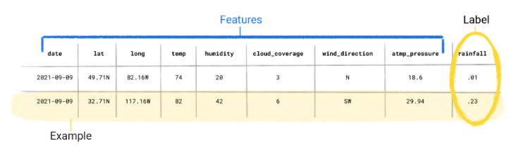
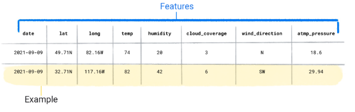
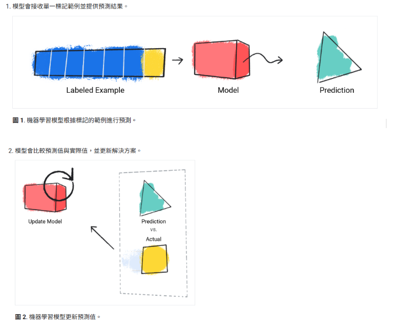

## 機器學習密集課程

**日期**：2025-11-04  
**來源**：Google Developers - Introduction to Machine Learning  
**關聯主題**：AI、機器學習、監督式學習、非監督式學習、生成式 AI、強化學習

---

### 📘 學習摘要

#### 🧠 機器學習基本觀念

- 機器學習（ML）透過**訓練模型**從資料中學習規律，而非人工撰寫規則。
- 模型能根據大量資料自動找出數學關係，用於預測或產生新內容。
- 不同於傳統物理模型需解方程式，ML 用資料學習模式，例如：天氣預測、影像辨識等。

#### 🔍 機器學習的主要類型

1. **監督式學習**：以標記資料訓練模型，用於迴歸（預測數值）與分類（預測類別）。
2. **非監督式學習**：沒有標籤，模型需自行分群（clustering）找出資料模式。
3. **強化學習**：模型透過行動與回饋（獎勵／懲罰）學習策略。
4. **生成式 AI**：能根據輸入產生文字、圖片、程式碼、影片等新內容。

#### ⚙️ 監督式學習核心概念

- **資料集 (Dataset)**：由多個示例組成，每個包含特徵（features）與標籤（label）。
- **資料品質**：需具備足夠數量與多樣性，才能讓模型學到穩定模式。
- **模型訓練**：模型學習輸入特徵與標籤之間的映射，透過最小化「損失 (loss)」優化參數。
- **評估與推論**：利用未訓練資料測試模型表現，最終用於實際預測（推論）。

#### 📊 迴歸與分類

- **迴歸 (Regression)**：預測連續值（房價、降雨量等）。
- **分類 (Classification)**：預測離散類別（二元或多類別）。

#### 🧩 非監督式學習與分群

- 在無標籤資料中找出自然群組，意義需由人類專家詮釋。
- 常見應用：市場分群、異常檢測、推薦系統等。

#### 🎨 生成式 AI 概念

- 生成式模型可根據訓練資料學習分布，產生新的樣本（文字、圖片、程式碼等）。
- 支援多模態輸入與輸出（如文字 → 圖片、圖片+文字 → 影片）。
- 多先以非監督訓練，後續再以監督或強化方式微調以符合任務需求。

#### 🔢 重要術語

| 名稱             | 說明                                           |
| ---------------- | ---------------------------------------------- |
| 特徵 (Feature)   | 模型用來預測標籤的輸入資料。                   |
| 標籤 (Label)     | 預測目標或答案，例如房價、氣溫、分類結果。     |
| 損失 (Loss)      | 預測與真實答案的差距，模型訓練時會最小化此值。 |
| 推論 (Inference) | 使用已訓練模型進行實際預測的過程。             |

---

### 看圖說故事

監督式學習兩個標記範例

監督式學習兩個未標記的示例

監督式學習如何訓練模型

---

### 💡 前端應用

這份課程讓我更清楚機器學習不僅僅是「訓練模型」，而是一整套**資料 → 模型 → 評估 → 推論**的流程。  
作為前端工程師，我可以：

- 理解 AI 模型如何運作，進而在前端應用中（如推薦系統、智慧搜尋）設計更合理的介面與資料流。
- 將生成式 AI 技術融入產品開發，例如自動內容生成、程式碼提示或多語系翻譯。

---

### 🔗 延伸學習

- [Google ML Crash Course 官方網站](https://developers.google.com/machine-learning/intro-to-ml/what-is-ml)
- 深入主題：
  - **線性迴歸**與**邏輯迴歸**模型
  - **分群演算法 (K-Means, DBSCAN)**
  - **強化學習應用（例如自駕車、遊戲 AI）**
  - **生成式模型（GPT、Diffusion Model、GAN）**
