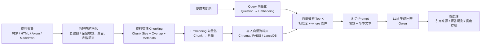

# 前置作業

## 第一步：確認模型

### 明確應用場景與目標

> 最佳模型的選擇是需求、硬體和效能三者平衡的結果。建議的步驟是：先定義清楚您的應用場景，根據現有硬體篩選出可運行的模型範圍，然後參考公開評測與實際測試結果，最終選擇最符合您需求的模型。

界定模型的用途。不同的任務需要不同能力傾向的模型：

- 任務類型： 問答、摘要、翻譯、程式碼生成，還是創意寫作
- 語言需求： 專注於中文、英文，還是多語言（許多開源模型針對特定語言進行了優化，例如有些模型在中文處理上表現特別好。）
- 回應速度 (延遲)： 是用於即時互動的聊天機器人，還是可以接受較長處理時間的離線批次任務？

### 評估硬體資源與限制

本地部署最大的限制往往來自於硬體規格。
硬體能力（特別是 GPU 顯存 (VRAM)）直接決定了能運行的模型大小（參數數量）：
ex: GPU VRAM 大小： 8GB VRAM 可能適合運行 7B 參數的模型，而運行 70B 參數的模型可能需要 40GB 以上的 VRAM。

- 量化 (Quantization)： 如果硬體資源有限，可以考慮使用量化 (如 GGUF 或 AWQ 格式) 的模型，這能以些微的效能損失換取大幅降低的記憶體佔用。
- CPU/RAM 替代方案： 如果沒有高性能 GPU，某些工具 (如 Ollama 或 LM Studio) 支援在 CPU 上運行模型，但速度會慢很多。

### 研究與比較模型效能

評估具體模型的表現：
參考評測榜單： 利用公開的排行榜，例如 LMSYS Chatbot Arena Leaderboard 或 Hugging Face Open LLM Leaderboard，了解不同模型在客觀基準測試上的得分。

- 關注特定領域的微調模型 (Fine-tuned Models)： 基礎模型 (Pre-trained Models) 可能通用性強，但針對特定任務微調過的模型 (如指令微調模型 instruction-tuned) 通常在實際應用中表現更佳。

### 實際動手測試

理論結合實踐最重要。不論數據如何，最重要的是模型在您的目標情境下能否達到預期。

- 使用本地部署工具： 利用 LM Studio 或 Ollama 這類工具，它們提供了簡易的介面，方便您快速下載、運行和切換不同的開源模型進行實際測試。

### 考慮資料隱私與合規性

本地部署的核心優勢之一是資料隱私性，資料不需要離開您的伺服器或電腦。確保所選模型的使用條款符合您組織的合規要求。

## 第二步：RAG 前置作業

> 前置作業主要分為資料準備、環境建置與流程規劃三個階段。這些步驟對於確保 RAG 系統的準確性和效率至關重要：
>> 為什麼有了本地 LLM 還需要 RAG?  
>> 因為 LLM 不會自動知道你的私有文件/原型內容，RAG 讓它能「先查資料再回答」，把答案基於你的知識庫，而不是憑印象亂猜

### 流程圖



```
Indexing Pipeline（離線）
- ingest.ts
- htmlParser / pdfParser
- chunkStrategy
- embedding.ts
- vector.ts (Chroma)

Query Pipeline（線上）
- queryBuilder
- collection.query (Top-K + where)
- promptTemplate
- qwen inference (ollama / vllm)

```

### 階段一：知識庫資料準備與處理

這是 RAG 成功的基石。模型本身不具備您的私有知識，必須將這些知識轉化為可檢索的格式。

1. 收集與清理原始資料：
   - 收集： 確定所有相關文件來源（例如：PDF 文件、網站內容、資料庫紀錄、Markdown 檔案等）。
   - 清理： 移除不必要的資訊（如 HTML 標籤、多餘的空白行、浮水印），確保資料乾淨且結構化。
2. 資料切分 (Chunking)：
   - 目的： LLM 的上下文窗口有限，無法一次讀取整本書。需要將大文件切分成小塊（Chunks）。
   - 考量： 切塊的大小至關重要，太小會失去語境，太大則可能超出模型限制或稀釋重點。通常會使用工具（如 langchain 或 llama-index）設定合適的字符數或 token 數，並輔以重疊 (Overlap) 確保上下文連貫。

### 階段二：環境建置與模型準備

準備運行 RAG 所需的軟體環境和模型。

1. 安裝必要套件：
   - 需要 Python 環境，並安裝相關函式庫，例如：
        - langchain 或 llama-index：用於構建 RAG 流程的框架。
        - transformers 或 openai：用於加載和運行模型。
        - torch：深度學習框架。
        - ollama 或 vllm：用於本地部署和高效能推理 Qwen 模型。
2. 選擇並下載 Qwen 模型：
    - 決定您需要的 Qwen 版本（例如 Qwen-7B 或 Qwen-14B，取決於您的硬體）。
    - 從 Hugging Face 或使用 Ollama 等工具下載模型檔案到本地機器。
3. 選擇並設定嵌入模型 (Embedding Model)：
    - RAG 需要將文本塊轉換為向量（數字表示的語義含義），這需要一個獨立的嵌入模型。
    - 雖然 Qwen 擅長生成回答，但通常會使用專門優化的嵌入模型，例如 m3e-base、bge-small-en-v1.5，或阿里巴巴自己的 text-embedding 系列，這些模型在中文字處理方面通常表現良好。

### 階段三：向量化與建立索引

將切分好的資料存儲起來，以便快速檢索。

1. 資料向量化：
    - 使用您選擇的嵌入模型，將階段一中切分好的每一個文本塊轉換成高維度向量 (Embeddings)。
2. 選擇與設定向量資料庫 (Vector Database)：
    - 需要一個專門的資料庫來高效存儲和搜尋這些向量。常見的選擇包括：
        - 開源本地選項： ChromaDB, LanceDB, FAISS（僅索引）。
        - 雲端或託管服務： Pinecone, Weaviate, Milvus。
    - 將所有向量及其原始文本存入選定的向量資料庫，並建立索引。

### 階段四：RAG 流程整合測試

將所有組件連接起來，形成一個可運作的系統。

1. 定義檢索邏輯： 確定當使用者提問時，系統如何從向量資料庫中檢索最相關的 K 個文本塊。
2. 整合提示工程 (Prompt Engineering)： 設計一個結構良好的提示模板 (Prompt Template)，指導 Qwen 模型：
   - 接收使用者的問題。
   - 接收檢索到的上下文資料。
   - 要求 Qwen 僅根據提供的資料進行回答，並忽略它本身的預訓練知識（防止「幻覺」）。
  

  ---
  
  【待整理】
  以下你的「RAG 前置作業」整體方向**大致正確**，而且已涵蓋核心 4 大段（資料→環境→向量索引→整合測試）。我會用「✅正確 / ⚠️需補強 / ❗常見踩雷」的方式，幫你快速校正成**更可落地的本地 RAG checklist**（尤其符合你現在用 Qwen + 本地環境 + 你之前在 Chroma/ingest/query 遇到的坑）。

---

## 1) 一句話：為什麼有了本地 LLM 還需要 RAG

因為 **LLM 不會自動知道你的私有文件/原型內容**，RAG 讓它能「先查資料再回答」，把答案基於你的知識庫，而不是憑印象亂猜。

---

## 2) RAG 基本流程（文字流程圖）

1. **資料收集**（PDF/HTML/Axure/Markdown…）
2. **清理與結構化**（去雜訊、保留章節/標題/頁面/表格語意）
3. **切塊 Chunking**（加 overlap、保留結構 metadata）
4. **Embedding 向量化**（每個 chunk → 向量）
5. **寫入向量庫 + 索引**（Chroma/FAISS/LanceDB…）
6. **Query 轉向量**（使用者問題 → query embedding）
7. **檢索 Top-K**（向量相似度 + 過濾 where）
8. **組 Prompt**（把「問題 + 命中文本」組成提示）
9. **LLM 生成**（Qwen 根據 context 回答）
10. **後處理**（引用來源、去重、長度控制、拒答規則）

---

## 3) 你的清單逐段檢查（對 / 缺 / 需要更精準的點）

### 階段一：資料準備與處理

* ✅ **收集/清理**：正確
* ✅ **Chunking + overlap**：正確
* ⚠️ **你少了「結構化 metadata 設計」**（RAG 命中準不準，這點超關鍵）
  建議至少存：

  * `source`（docs/prototype）
  * `pageId/pageName`（Axure 頁面唯一識別）
  * `sectionTitle / headingPath`（章節路徑）
  * `chunkId / order`（同頁排序）
  * `prototypeSource`（html / img_ocr / datajs…）
  * `lang`（zh/…）
* ❗**常見踩雷：只存純文字不存結構** → 會出現你之前遇到的「有頁面但 AI 說找不到」「命中無關內容」
  因為檢索階段無法做有效的 where/重排/聚合。

### 階段二：環境建置與模型準備

* ✅ 安裝套件：方向正確
* ⚠️ 你寫「transformers 或 openai」：

  * 在**純本地**情境下，通常是 `transformers / vllm / llama.cpp / ollama` 其一；`openai` 不一定需要（除非你要接 OpenAI API）。
* ⚠️ **Qwen 用來生成沒問題，但 embedding 模型要分開選**：你有寫到，這點正確。
* ❗**常見踩雷：embedding 模型與語料語言不匹配**（中文文件用英文向量模型）→ 語意搜尋會很飄。

### 階段三：向量化與索引

* ✅ 向量化 + 向量庫：正確
* ⚠️ **要補「索引可維護性」**（你之前有做 ingest:update/reset 的需求）
  建議在設計上要能：

  * 以 `docId/pageId + chunkId` 做 upsert 或可重建
  * 追蹤 `contentHash / updatedAt` 做增量更新
* ❗**常見踩雷：Chroma metadata 型別限制**（你之前遇過）

  * metadata 值必須是 string/number/bool（避免塞物件/陣列），必要時把陣列 JSON.stringify。

### 階段四：RAG 流程整合測試

* ✅ 檢索 Top-K + prompt template：正確
* ⚠️ **你少了「retrieval 評估與 debug」**（這是新手最容易卡住的）
  建議加兩個必備測試：

  1. **Retrieval-only**：只印出 Top-K chunks（含距離、pageName、chunk 前 200 字）
  2. **Answer-with-citations**：回答時強制列出引用來源（pageName + chunkId）
* ⚠️ 你寫「要求模型忽略預訓練知識」：概念正確，但實務上要改成

  * **給清楚的拒答規則**：若 context 不足就說「資料庫未找到」並回傳最接近的頁面/段落（避免硬掰）。

---

## 4) 本地 LLM 做 RAG 前置處理 Checklist（建議你用這份當 README）

### A. 資料層

* [ ] 定義資料來源清單（docs / prototypes / tickets…）
* [ ] 清理規則（去 watermark / 多餘空白 / 控制字元 / 亂碼）
* [ ] 結構抽取（標題層級、表格欄位語意、列表項目）
* [ ] Chunk 策略（大小、overlap、切分依標題或區塊）
* [ ] metadata schema（至少：source/pageName/chunkId/order）

### B. Embedding 層

* [ ] 選 embedding 模型（中文優先）
* [ ] 統一向量維度（不要換模型不重建索引）
* [ ] query builder（避免把整段 user prompt 直接 embed，抽 focus topic）

### C. 向量庫層

* [ ] collection 命名與版本（例如 `company_rag_v1`）
* [ ] upsert / reset / update 策略（增量更新）
* [ ] where filter 設計（避免 Chroma where 規則錯誤）
* [ ] debug 查詢工具（Top-K + metadata 檢查）

### D. 生成層（Qwen）

* [ ] prompt template（含：角色、資料來源、引用格式、拒答規則）
* [ ] context 安全切割（避免超出上下文導致 timeout）
* [ ] 回答格式（條列步驟 + 引用頁面）

---

## 5) 新手建議的第一步行動（最小可行路線）

你現在最值得先做的是：

1. **先做「Retrieval-only Debug」**（不要先管 LLM 回答）
   → 目標：任何 query 都能穩定列出 Top-K chunk，且 metadata 正確（pageName、chunkId、距離合理）。

2. **再做「Answer-with-citations」**
   → 目標：Qwen 的回答每一段都能對應到命中的 chunk 來源，並能在找不到時拒答。

如果你願意用你現有的 Node.js + Chroma 架構，我也可以直接把這兩支最小工具（debug query + citations prompt）用你現在的命名（collection/where/prototypeSource）對齊成一套「可貼上就跑」的版本。
