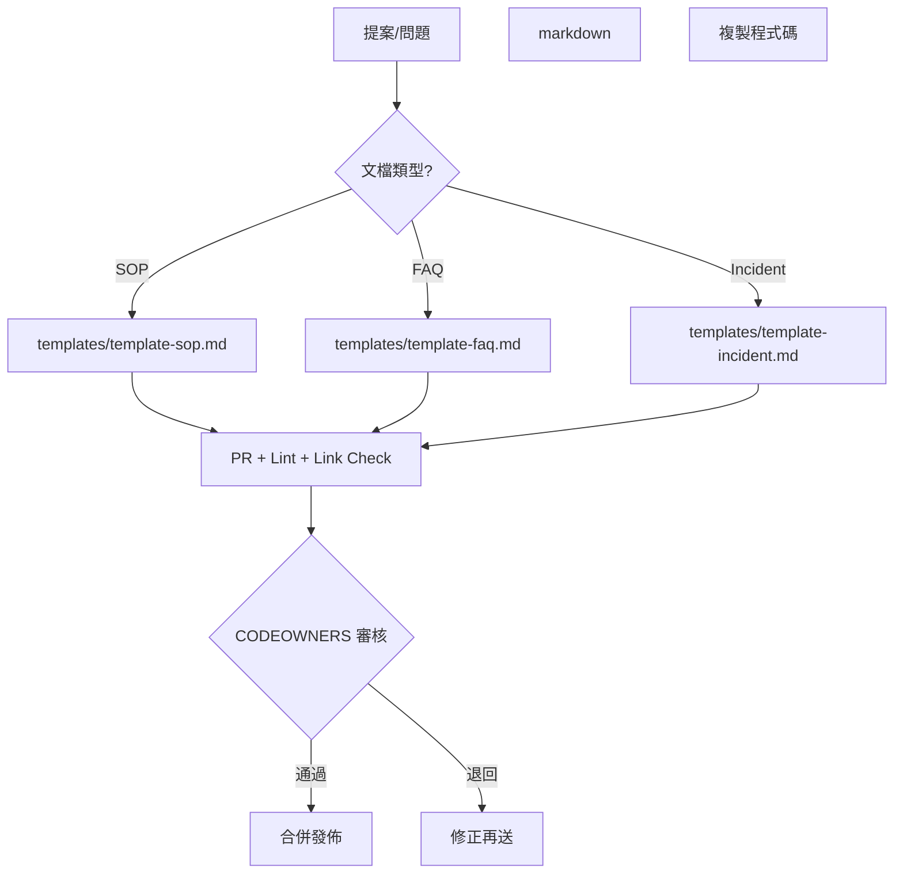

## 摘要
- 影響範圍 / 指標 / 影響時段

## 時間線
- 00:00 發現…
- 00:05 緩解…

## 根因分析
- 技術 / 流程 / 人員

## 行動項目（需指派責任人與截止日）
- [ ] 修正項 A（owner: @alice，due: 2025-10-31）

## 相關連結
- 工單、PR、Dashboards、Log Query

>備註：VS Code 內可用擴充套件預覽；GitHub 也原生支援 Mermaid。